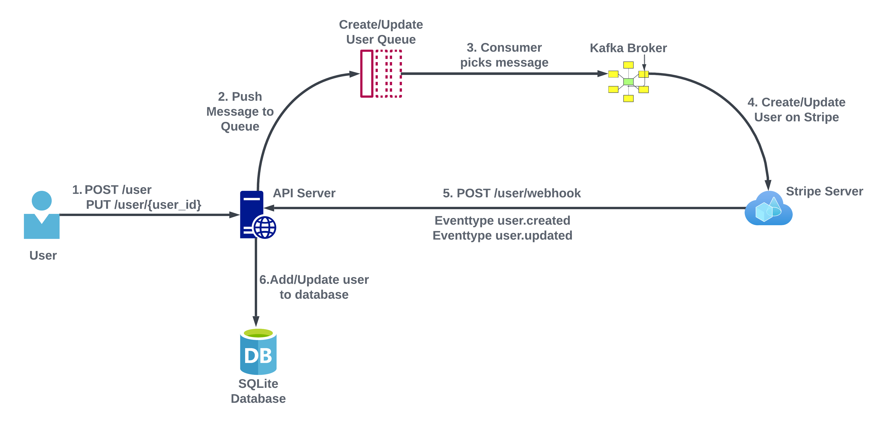

<div align="center">
      <h1>SyncFast</h1>
</div>


# Description
This project integrates FastAPI with Kafka for efficient asynchronous message handling, leveraging Docker to containerize the Kafka environment for scalability. It also includes Stripe integration with webhooks to ensure seamless synchronization of user data between Stripe and the local database, using Kafka consumers to maintain data consistency.

# Features
- Integrated **FastAPI** with **Kafka** for asynchronous message processing in distributed systems.
- Used **Docker** to containerize the Kafka environment, ensuring scalability and consistency.
- Implemented **Stripe integration** with webhooks for syncing user data between Stripe and the local database.
- Ensured data consistency across systems using **Kafka consumers** for real-time updates.
# Flow
 

# Tech Used
      

### Pre-Requisites:
1. Install [Git](https://git-scm.com/) Version Control
2. Install [Python](https://www.python.org/downloads/) Latest Version

#### Use python 3.11 or above
3. Install [Pip](https://pip.pypa.io/en/stable/installing/) (Package Manager)
4. Install [Docker Desktop](https://www.docker.com/products/docker-desktop/)
5. Install [Node.js](https://nodejs.org/en/download) (For using localtunnel)
6. Install Localtunnel
```
npm install -g localtunnel
```

7. Create [Stripe](https://dashboard.stripe.com/register) test account and copy secret key
8. Create a [webhook](https://test-stripe.loca.lt/user/webhook) on Stripe with url and add events customer.created and customer.updated, also copy signing secret which we will require to verify webhook requests

### Installation
**1. Navigate to directory where you want to save the project**

**2. Clone this project**
```
git clone git@github.com:iamrohansood/SyncFast.git
```

Then, Enter the project
```
cd fastapi-stripe-integration
```
**3. Create a Virtual Environment**

Create Virtual Environment
```
python3 -m venv env
```
**4. Create .env file from .env.example in main_app/user folder and stripe_worker folder**

Add Stripe secret key and Stripe enpoint secret key(which we get after creating webhook) to .env

**5. Now we will require 5 terminals in fastapi-stripe-integration folder. Let's name them Terminal1, Terminal2, ..... for simplicity**
1. In Terminal1 run
```
docker-compose up
```
2. In Terminal2 run
```
source env/bin/activate
pip install -r main_app/requirements.txt
uvicorn main_app.main:app --reload
```
3. In Terminal3 run
```
source env/bin/activate
cd stripe_worker
pip install -r requirements.txt
python3 consumer_create_user.py
```
4. In Terminal4 run
```
source env/bin/activate
cd stripe_worker
pip install -r requirements.txt
python3 consumer_update_user.py
```
5. In terminal5 run
```
lt --port 8000 --subdomain test-stripe
```
Open [URL](https://test-stripe.loca.lt/docs) in any browser for api documentation
